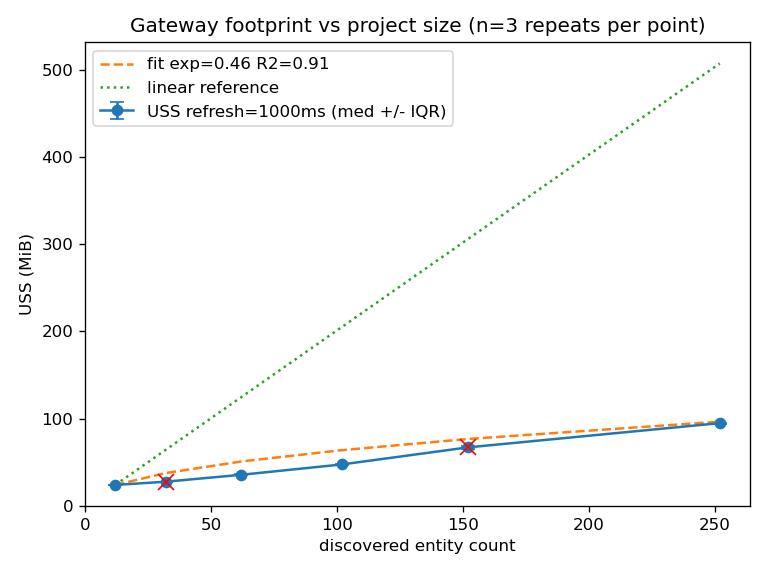

# Gateway Benchmark Harness

A benchmark for the ros2_medkit gateway. It measures the gateway process's memory
and CPU cost while it runs against a real or synthetic ROS 2 graph, and reports the
numbers with statistical confidence (repeats and spread, not a single sample).

It answers four questions:

- How much memory and CPU does the gateway use on a real stack?
- How does that cost grow as the ROS 2 graph gets larger?
- Which gateway config setting costs the most?
- Does the heap grow over time (a leak), and where?

## What it measures

| Metric | Meaning |
|---|---|
| **USS** (Unique Set Size) | Private memory of the gateway process - the pages that would be freed if it exited. This is the honest per-process footprint and the primary memory metric here. |
| **PSS** (Proportional Set Size) | Private pages plus each shared page divided by the number of processes sharing it. Fairer than RSS when libraries are shared. |
| **RSS** (Resident Set Size) | All resident pages including shared libraries. Reported as an upper bound only. |
| **CPU-cores** | CPU-seconds consumed per wall-clock second. `1.0` means one core fully busy; can exceed 1 (the gateway is multi-threaded). Machine-independent. |
| **threads** | Thread count of the gateway process. |
| **heap growth** | Allocated heap over time and per-call-site, from heaptrack. |

USS, PSS and RSS are read from `/proc/<pid>/smaps_rollup`; CPU is computed from the
`utime`+`stime` counters in `/proc/<pid>/stat`.

## Method

The goal is numbers you can trust and compare, not a single reading.

1. **Process isolation.** Only the gateway process is sampled (resolved by name
   inside its container), never the whole stack. A footprint of "the gateway" must
   not include Gazebo or Nav2.
2. **Warm-up gate, enforced.** Sampling starts only after the gateway has settled:
   entity discovery is stable across several refresh cycles *and* memory has stopped
   climbing. If a run does not converge within the timeout, it is **flagged
   not-steady and excluded from the steady-state median** - never silently reported
   as steady. The report shows how many repeats were steady (e.g. `4/5`). When
   **zero** repeats reach steady state, the aggregate falls back to all repeats and
   the result is marked `steady=no (0/N)` so the reader knows the numbers are
   unsettled, not that the run was dropped.
3. **Fixed-interval sampling.** During the measurement window the harness reads
   `/proc` at a fixed interval and computes per-sample CPU from consecutive counter
   deltas, so a CPU spike is visible rather than averaged away. The `samples` column
   is the steady-window count the statistics are actually computed from.
4. **Repeats and spread.** Each data point is several independent runs, each in a
   **fresh container**, to capture run-to-run variance. The report gives the median
   and the **IQR** (interquartile range - the spread of the middle 50% of runs).
   A difference smaller than the IQR is noise. A single repeat gives no spread, so
   the chart marks low-repeat and not-steady cells.
5. **Scaling by fit with a confidence interval.** The scaling lane fits a power law
   (`USS ~ entities^k`) and reports `k` with its 95% confidence interval. It claims
   super-linear only when the CI lower bound exceeds 1, sub-linear only when the CI
   upper bound is below 1, and otherwise says INDETERMINATE. Few points give a wide
   CI and an honest INDETERMINATE - the harness will not read a scaling law off 3-4
   points. The fit is run per refresh rate, never pooled across configs.
6. **Single DDS domain per cell.** For the synthetic lanes the gateway and the
   generated graph run in **one** container, because the Docker bridge network does
   not forward DDS (the ROS 2 transport) multicast discovery between containers -
   two containers would simply not see each other.
7. **Leak detection.** The `/proc` USS slope over a window is only a *screening*
   signal. Its confidence interval is corrected for autocorrelation (consecutive
   `/proc` samples are not independent, so a naive interval is too narrow). A
   positive slope **without** attributable heaptrack call-sites is reported as
   inconclusive (warmup/cache fill), not a leak. The authoritative test is the heap
   lane over a long run; valgrind memcheck gives a hard "definitely lost" verdict on
   a short controlled run.
8. **Reproducibility.** The synthetic lanes (scaling, sweep, heap, memcheck) record
   the gateway commit SHA from `/ws/gateway_sha` inside the image. The footprint
   lane uses the turtlebot3 demo image, which does not write that file; it records
   the demo image digest instead (the digest identifies which gateway build is
   bundled in the demo image). All runs also record host CPU/RAM/allocator/kernel
   and the config used, in `run_metadata.json`. Pin `ROS2_MEDKIT_REF` to a commit
   SHA to compare across time. The harness warns when host load exceeds the core
   count (and aborts with `--strict`), because footprint/CPU under contention is
   not comparable.

## Lanes

| Command | What it does |
|---|---|
| `footprint` | Steady-state memory and CPU on the turtlebot3 demo (a real headless Nav2 stack), repeated. |
| `scaling` | Footprint vs synthetic graph size; fits the growth curve. |
| `sweep` | Footprint and CPU for each gateway config variant (one setting changed off the default). |
| `heap` | heaptrack over a long run: heap growth over time and top allocation call-sites. |
| `memcheck` | valgrind memcheck on a short controlled run: definitely/indirectly lost bytes. |
| `load` | Footprint, CPU, threads and request latency (p50/p95) under M concurrent HTTP clients (off/light/heavy). |
| `fault` | Snapshot-capture impact as a burst (peak memory/CPU, capture duration, recovery) vs fault count N, with and without rosbag. |
| `all` | Runs the above and writes one combined report. |

`footprint`, `scaling`, `sweep` measure steady state; `load` adds an HTTP-client
dimension (and `--load light|heavy` composes onto `footprint`); `fault` measures a
transient burst, not steady state.

## Example results

From one host (Intel i7-10700K, 16 cores, 32 GiB, glibc allocator). Absolute
numbers depend on hardware; re-run for your own. The value is the method.

Footprint on a real headless Nav2 stack (turtlebot3, ~22 discovered entities,
5 repeats): gateway USS around 95-100 MiB, PSS ~104 MiB, RSS ~128 MiB, 53 threads,
~0.2-0.3 CPU-cores under live diagnostics. Note: the gateway takes a while to settle
on this stack, so some repeats are flagged not-steady and excluded from the median;
the report shows the steady count.

Scaling, gateway against a synthetic graph (6 sizes, 3 repeats each):



| entities | USS | USS per entity |
|---|---|---|
| 12 | 24 MiB | 2.01 MiB |
| 32 | 28 MiB | 0.87 MiB |
| 62 | 36 MiB | 0.58 MiB |
| 102 | 48 MiB | 0.47 MiB |
| 152 | 67 MiB | 0.44 MiB |
| 252 | 95 MiB | 0.38 MiB |

Fitted exponent **k = 0.46, 95% CI [0.26, 0.65]** (6 points, R2 = 0.91). Because the
whole CI is below 1, this is **sub-linear, confirmed**: memory grows slower than the
graph and per-entity cost falls as it grows. The gateway does not blow up on a large
project. (On only 3-4 points the CI spans 1 and the harness reports INDETERMINATE
instead - more points are needed to make the claim.) Absolute footprint is driven by
graph *complexity* (topic and message-type count) more than node count - a Nav2 node
with maps and scans costs several times more than a plain talker.

Config sweep showed the discovery refresh interval as the main CPU lever: 200 ms
costs about 4x the CPU of the 1000 ms default, while memory differences across
configs stayed within a few MiB.

Heap: a short synthetic run reports `inconclusive: warmup/cache fill` (positive USS
slope but no attributable leak call-sites). A 25-min heaptrack run on the **real Nav2
demo** (gateway rebuilt with debug symbols, `benchmark/scripts/heap_on_nav2.sh`) settles
the question: the tracked heap plateaus at ~15.7 MiB (the last 40 % of the run adds
+0.7 MiB, final snapshots flat), so the gateway does **not** leak on Nav2. The slow USS
creep some footprint repeats show is warmup / per-message-type cache fill that takes
~15-20 min to settle (longer than the footprint lane's 120 s window), plus non-heap
allocator-arena retention - not growing allocations.

HTTP load (synthetic graph, off / 8 clients / 32 clients): USS 28 -> 29 -> 35 MiB,
CPU 0.01 -> 0.02 -> 0.18 cores, request p95 latency 1.6 -> 2.3 ms. The thread census
shows ~50 threads of which ~39 share the `gateway_node` comm (the rclcpp executor and
cpp-httplib pools), 9 are DDS. Latency stays low under load; the thread count is the
efficiency concern, not latency.

Fault / snapshot (synthetic, fault count N, 20 s window, a fresh container per N so
each baseline is clean): peak USS delta grows monotonically with N (~0.5 MiB at N=1 ->
~5.8 MiB at N=16); capture recovers within the window only for N<=2, and at **N>=4 it
no longer returns to baseline within 20 s**. Each cell is a single sample (n=1).
Sequentially reported faults each get their own rosbag (no contention); simultaneous
reporting would
hit the single rosbag writer.

## What to optimize

The benchmark points at three concrete targets:

- **Cap the executor / HTTP thread pool.** ~50 threads at idle, ~39 of them the
  rclcpp executor + cpp-httplib pools. The `MultiThreadedExecutor` defaults to one
  thread per hardware core; a bounded pool sized to the actual work would cut thread
  overhead. (`load`, thread census.)
- **Make snapshot capture asynchronous / queued.** Capture stays fast for <=2
  concurrent faults but at N>=4 it no longer returns to baseline within the window and
  peak memory grows monotonically with N (~5.8 MiB at N=16), so captures queue faster
  than they drain. An async capture queue with bounded buffers would keep a fault storm
  from blocking.
  (`fault`.)
- **Watch the refresh interval for CPU.** A 200 ms discovery refresh costs ~4x the
  CPU of the 1000 ms default for little memory benefit. (`sweep`.)

These are signals to investigate, sized on one host - re-run to confirm on yours.

## Running it

```bash
git clone https://github.com/selfpatch/selfpatch_demos.git
cd selfpatch_demos
python -m venv .venv && source .venv/bin/activate
pip install -r benchmark/requirements.txt
```

All `python -m benchmark.benchmark` commands must be run from the **repo root** (the directory containing `benchmark/`).

Requires Docker, Docker Compose v2, and Python 3.10+.
The heap and memcheck lanes build a debug-symbol gateway image automatically.

```bash
python -m benchmark.benchmark all                                   # every lane + combined report
python -m benchmark.benchmark footprint --duration 300 --repeats 5
python -m benchmark.benchmark scaling --entities 10,50,100,200 --refresh-ms 200,1000,5000
python -m benchmark.benchmark sweep --entities 50
python -m benchmark.benchmark heap --duration 1800 --entities 50
python -m benchmark.benchmark memcheck --entities 10
python -m benchmark.benchmark load --entities 30
python -m benchmark.benchmark fault --faults 1,2,4,8,16
python -m benchmark.benchmark footprint --load heavy        # footprint under HTTP load
```

## Output

Each run writes to `benchmark/results/<timestamp>/<lane>/`:

- `report.md` - the table for that lane, with median and IQR
- `*.png` - the chart (scaling curve with fit, or per-config bars)
- `summary.json` - machine-readable numbers plus a one-line verdict
- `run_metadata.json` - host CPU and RAM, image, allocator, and gateway version, so
  two runs are comparable

Results are gitignored; commit your own copy if you want to track them over time.

## Reference point

The published example numbers (in [Example results](#example-results)) were measured on:

- **Host:** Intel(R) Core(TM) i7-10700K CPU @ 3.80GHz, 16 cores, 32 GiB RAM
- **Gateway SHA:** `8569f213e7a1e4b4fd2f699546eda9a11e78dcf1` (scaling lane)
- **Footprint gateway SHA:** captured from image digest (SHA capture added after this seed run; will be real on the next footprint build)

### Benchmarking a specific commit

```bash
export ROS2_MEDKIT_REF=<sha>          # pin to a gateway commit
python -m benchmark.benchmark scaling --entities 10,50,100,200
python -m benchmark.benchmark footprint --duration 300 --repeats 5
```

Docker Compose passes `ROS2_MEDKIT_REF` through to the image build arg
so both the synthetic and turtlebot3 images clone that exact commit.

### Regression tracking workflow

```bash
# 1. Run your lanes against a pinned commit
export ROS2_MEDKIT_REF=<new-sha>
python -m benchmark.benchmark scaling --entities 10,50,100,200

# 2. Compare against the committed baseline
python -m benchmark.benchmark compare --run latest --baseline benchmark/baseline/ci.json
# Exits 0 (OK/WARN), 1 (REGRESSION), or 2 (host mismatch / high load)

# 3. If the new numbers represent an intentional improvement, update the baseline
python -m benchmark.benchmark update-baseline --run latest --name ci
git add benchmark/baseline/ci.json && git commit -m "chore: update benchmark baseline"
```

The baseline is host-keyed: `compare` hard-refuses if the machine differs.
Run on the same self-hosted runner to get a valid comparison.

## Limitations

- Numbers are per-host; compare runs on the same machine.
- The synthetic graph uses plain publishers/subscribers/services, so it under-states
  the per-entity cost of a heavy real graph (use the `footprint` lane on the real
  demo for that).
- Wired to the turtlebot3 demo and the synthetic graph; other demos are not yet
  implemented.
- The `heap`/`memcheck` lanes run on the synthetic gateway (which has debug symbols).
  A long heaptrack run on the real Nav2 demo (to settle leak-vs-cache for the slow
  footprint creep) needs a debug-symbol demo image and is not yet wired.
- The `fault` lane reports faults sequentially, so each gets its own rosbag; measuring
  the single-writer rosbag contention needs parallel fault reporting.

DooD note: probing the gateway goes through `docker exec` (not the published port),
so the harness works under docker-out-of-docker as well as plain Docker.
